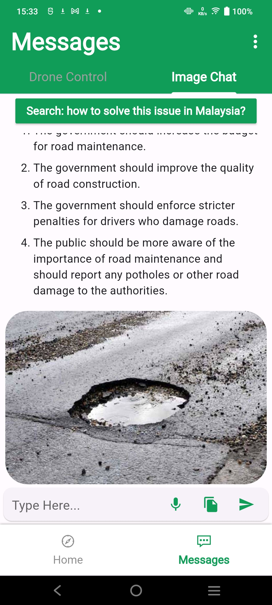
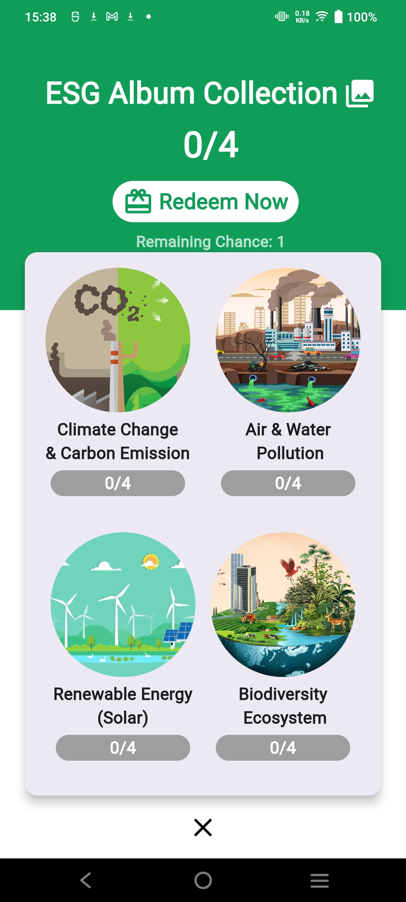

# AIShield
## Problem Statement
AI Shield for Google Solution Challenge 2024

## Technologies Used

*   Flutter
*   Firestore
*   Google Storage
*   YoloV8
*   Python
*   Unity/C#
*   Firebase App Distribution for tester

## Features

*   Take a photo of the rock pool you found, it will then be uploaded and the organisms in the rock pools will be classified.
*   View all rock pools around you and view what's in them.
*   Create new rock pools and geo tag them.

#### Usage

AI Shield is a flutter mobile project that can be used in both IOS and Android

* `git clone https://github.com/kennethng2168/AI-Shield-Public.git`
* `flutter pub get`

To run the app, use the following command:

* `flutter run`

To debug or use the app for IOS, follow below steps:
1. Open the AI Shield Folder
2. Run without debugging on the main.dart

Alternatively, head over to the [release](https://github.com/kennethng2168/AI-Shield-Public/releases) page and download the `app-release.apk` file or [direct download link](https://github.com/kennethng2168/AI-Shield-Public/releases/download/v1.0/app-release.apk) for Android device.

## AI Shield Screenshots

Gemini Pro Flood Messages | Gemini Pro Potholes Messages| Gemini Pro Potholes Messages
:-------------------------:|:-------------------------:|:-------------------------:
 |  |
Home  |  Share Location | Security (Blur Screen)
 |  |
Login Cover  |  Login | Recovery Phrase
 |  |
Sign Up | Accident Details | Fire Details
 |  |
Report history Delete  | Report History | No Emergency Details
 |  |
Potholes Details | Reward | Reward Box
 |  |
Reward Card | Reward Album 
 |  |

##  Python Backend AI Inference
The AI Inference is built by using Python. The data was streamed from the firebase when there's new update to send AI inference images and results back to firestore and storage which can be visualize in both AI Shield (Flutter App) or Omni Twin (Unity)
```sh
pip install torch torchvision torchaudio --index-url https://download.pytorch.org/whl/cu118
pip install -r requirements.txt
python read_data.py
```

## Omni Twin

#### Usage

Omni Twin is a Unity project.

1. Download [Unity](https://unity.com/download)
2. Open the project in Unity.

Alternatively, head over to the [release](https://github.com/kennethng2168/AI-Shield-Public/releases) page and download the `OmniTwin.zip` file which contains the `OmniTwin.exe` binary.

### Flood Simulation


### Disaster


### Weather


